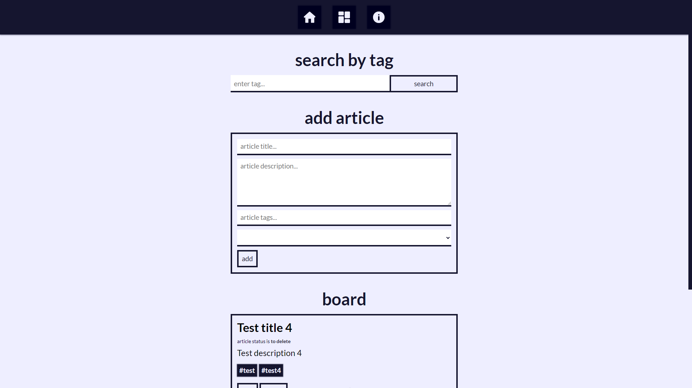
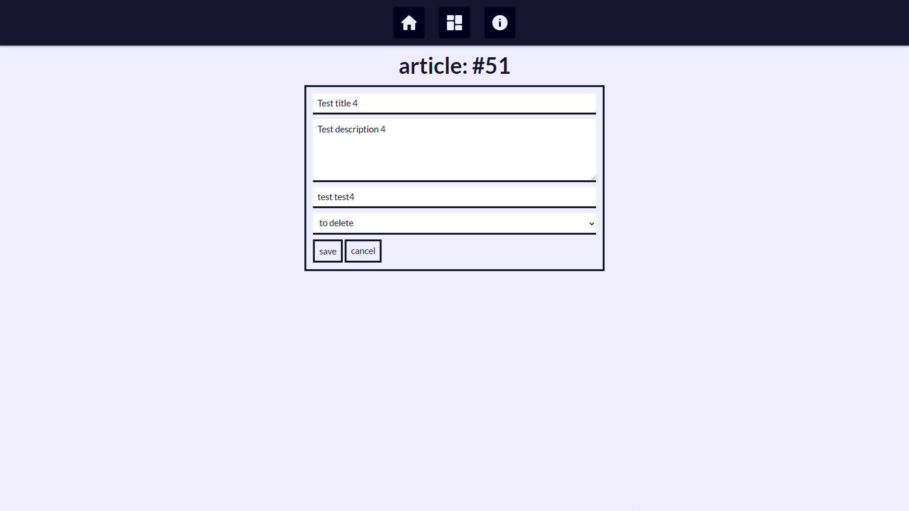
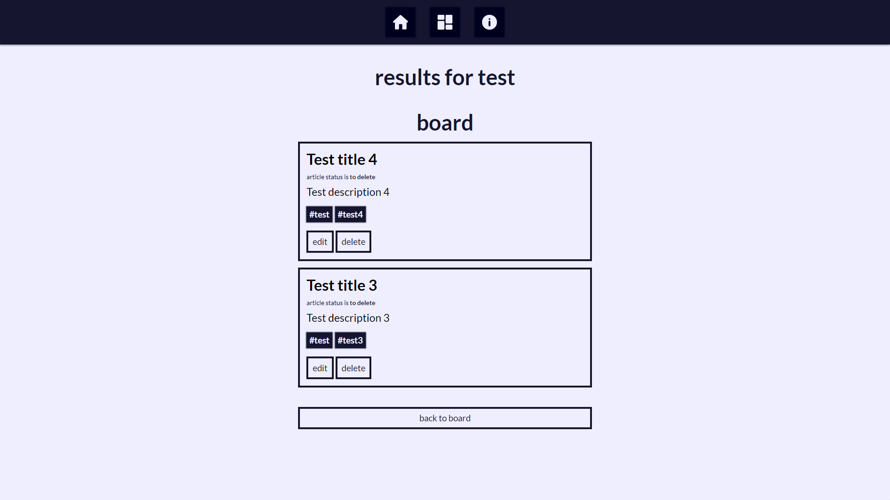

# Aurora recruitment task

Aurora recruitment task for PHP junior developer.

## Run locally

- clone repository `git clone [repository]`
- cd to source directory `cd [repository]/src`
- install dependencies `php composer.json install`
- run local development server `php -S localhost:[port]`
- create database `aurora` in MySQL
- recreate database from `/database/dump.sql`

## Information

- PHP: 8.0.7
- Database: MySQL
- Template engine: PUG
- .env file with basic configuration exists in repository
- database dump: /database/dump.sql

## Screenshots

